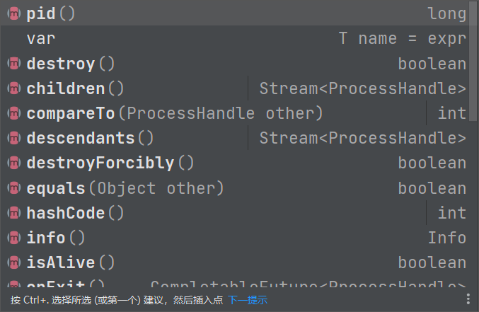
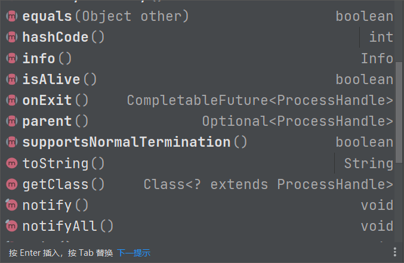

## 进程API

### 概述

Java 9 增加了 `java.lang.ProcessHandle` 接口来实现对原生进程进行管理，尤其适合于管理长时间运行的进程








### 使用

```java
package mao;

/**
 * Project name(项目名称)：JDK9_ProcessHandle_API
 * Package(包名): mao
 * Class(类名): Test1
 * Author(作者）: mao
 * Author QQ：1296193245
 * GitHub：https://github.com/maomao124/
 * Date(创建日期)： 2023/10/31
 * Time(创建时间)： 17:31
 * Version(版本): 1.0
 * Description(描述)： 无
 */

public class Test1
{
    public static void main(String[] args)
    {
        ProcessHandle current = ProcessHandle.current();
        System.out.println(current.pid());
        System.out.println(current.supportsNormalTermination());
        System.out.println(current.isAlive());
        System.out.println(current.info());
    }
}
```


```sh
30848
false
true
[user: Optional[MAO\mao], cmd: D:\java\corretto-17.0.8.1\bin\java.exe, startTime: Optional[2023-10-31T09:41:10.388Z], totalTime: Optional[PT0S]]
```


```java
package mao;

import java.util.function.Consumer;
import java.util.stream.Stream;

/**
 * Project name(项目名称)：JDK9_ProcessHandle_API
 * Package(包名): mao
 * Class(类名): Test2
 * Author(作者）: mao
 * Author QQ：1296193245
 * GitHub：https://github.com/maomao124/
 * Date(创建日期)： 2023/10/31
 * Time(创建时间)： 17:41
 * Version(版本): 1.0
 * Description(描述)： 无
 */

public class Test2
{
    public static void main(String[] args)
    {
        Stream<ProcessHandle> processes = ProcessHandle.allProcesses();
        processes.forEach(new Consumer<ProcessHandle>()
        {
            @Override
            public void accept(ProcessHandle processHandle)
            {
                if (processHandle.info().command().isPresent())
                {
                    System.out.println(processHandle.pid() + " -> " +
                            processHandle.info().totalCpuDuration().get() + " -> "
                            + processHandle.info().command().get());
                }
            }
        });
    }
}
```


```sh
36784 -> PT1.890625S -> C:\Program Files\NVIDIA Corporation\NvContainer\nvcontainer.exe
14360 -> PT48.859375S -> C:\Program Files\NVIDIA Corporation\NvContainer\nvcontainer.exe
28768 -> PT1.96875S -> C:\Windows\System32\sihost.exe
35136 -> PT0.015625S -> C:\Windows\System32\svchost.exe
38952 -> PT1.640625S -> C:\Windows\System32\svchost.exe
33404 -> PT0S -> C:\Windows\System32\svchost.exe
35620 -> PT1.328125S -> C:\Windows\System32\svchost.exe
38760 -> PT0.296875S -> C:\Windows\System32\taskhostw.exe
32388 -> PT55.21875S -> C:\Windows\explorer.exe
32160 -> PT1.671875S -> C:\Windows\System32\svchost.exe
17780 -> PT0.234375S -> C:\Windows\SystemApps\MicrosoftWindows.Client.CBS_cw5n1h2txyewy\SearchHost.exe
39152 -> PT0.546875S -> C:\Windows\SystemApps\Microsoft.Windows.StartMenuExperienceHost_cw5n1h2txyewy\StartMenuExperienceHost.exe
30856 -> PT0.75S -> C:\Program Files\WindowsApps\MicrosoftWindows.Client.WebExperience_423.23500.0.0_x64__cw5n1h2txyewy\Dashboard\Widgets.exe
37496 -> PT0.015625S -> C:\Windows\System32\RuntimeBroker.exe
23656 -> PT0.109375S -> C:\Windows\System32\RuntimeBroker.exe
23532 -> PT0S -> C:\Windows\System32\svchost.exe
10616 -> PT0.84375S -> C:\Program Files (x86)\NVIDIA Corporation\NvNode\NVIDIA Web Helper.exe
38168 -> PT0S -> C:\Windows\System32\dllhost.exe
40276 -> PT0.015625S -> C:\Windows\System32\conhost.exe
27600 -> PT0.0625S -> C:\Windows\System32\svchost.exe
16704 -> PT26.09375S -> C:\Program Files\WindowsApps\Microsoft.YourPhone_1.23082.131.0_x64__8wekyb3d8bbwe\PhoneExperienceHost.exe
9524 -> PT0.0625S -> C:\Program Files\WindowsApps\MicrosoftWindows.Client.WebExperience_423.23500.0.0_x64__cw5n1h2txyewy\Dashboard\WidgetService.exe
40448 -> PT0.09375S -> C:\Windows\System32\RuntimeBroker.exe
21944 -> PT0S -> C:\Windows\System32\SecurityHealthSystray.exe
19288 -> PT28.140625S -> C:\Program Files\NVIDIA Corporation\NVIDIA GeForce Experience\NVIDIA Share.exe
19256 -> PT0.046875S -> C:\Windows\System32\DriverStore\FileRepository\realtekservice.inf_amd64_917a88f607017da2\RtkAudUService64.exe
30092 -> PT0.0625S -> C:\Program Files\NVIDIA Corporation\NVIDIA GeForce Experience\NVIDIA Share.exe
20888 -> PT1.390625S -> C:\Program Files\NVIDIA Corporation\NVIDIA GeForce Experience\NVIDIA Share.exe
31428 -> PT1.875S -> D:\Program Files\Oray\SunLogin\SunloginClient\SunloginClient.exe
35216 -> PT4.15625S -> C:\Windows\SystemApps\MicrosoftWindows.Client.CBS_cw5n1h2txyewy\TextInputHost.exe
34024 -> PT1M28.25S -> D:\Program Files (x86)\Steam\steam.exe
35004 -> PT0.421875S -> C:\Windows\System32\NahimicSvc64.exe
30512 -> PT4.609375S -> C:\Windows\SysWOW64\NahimicSvc32.exe
6728 -> PT6.53125S -> C:\Windows\System32\DriverStore\FileRepository\ipf_cpu.inf_amd64_cf5beef3831571d4\ipf_helper.exe
20720 -> PT0.71875S -> D:\Program Files (x86)\SogouInput\13.7.0.8141\SGTool.exe
19612 -> PT37.859375S -> D:\Program Files (x86)\Steam\steamapps\common\wallpaper_engine\wallpaper32.exe
12688 -> PT23.953125S -> D:\Program Files (x86)\Steam\bin\cef\cef.win7x64\steamwebhelper.exe
23716 -> PT0.03125S -> D:\Program Files (x86)\Steam\bin\cef\cef.win7x64\steamwebhelper.exe
37364 -> PT0.625S -> D:\Program Files (x86)\Steam\bin\cef\cef.win7x64\steamwebhelper.exe
32372 -> PT0.703125S -> D:\Program Files (x86)\Steam\bin\cef\cef.win7x64\steamwebhelper.exe
27416 -> PT30.015625S -> D:\Program Files (x86)\Tencent\QQ\Bin\QQ.exe
19020 -> PT3S -> D:\Program Files (x86)\Steam\bin\cef\cef.win7x64\steamwebhelper.exe
14916 -> PT0S -> C:\Windows\System32\RuntimeBroker.exe
32960 -> PT1.1875S -> C:\Program Files\WindowsApps\ControlCenter3_5.17.49.6_x64__h329z55cwnj8g\Win32\SystrayComponent.exe
4184 -> PT0S -> D:\Program Files (x86)\Tencent\QQ\Bin\TXPlatform.exe
10584 -> PT0.296875S -> C:\Program Files\WindowsApps\AppUp.IntelGraphicsExperience_1.100.5185.0_x64__8j3eq9eme6ctt\GCP.ML.BackgroundSysTray\IGCCTray.exe
7000 -> PT0.03125S -> C:\Program Files\WindowsApps\AppUp.IntelGraphicsExperience_1.100.5185.0_x64__8j3eq9eme6ctt\IGCC.exe
1916 -> PT0S -> C:\Windows\System32\RuntimeBroker.exe
36420 -> PT0.03125S -> D:\Program Files (x86)\Steam\bin\cef\cef.win7x64\steamwebhelper.exe
23584 -> PT0.25S -> C:\Windows\SystemApps\ShellExperienceHost_cw5n1h2txyewy\ShellExperienceHost.exe
38540 -> PT0.15625S -> C:\Windows\System32\RuntimeBroker.exe
6140 -> PT0.015625S -> D:\Program Files (x86)\Adobe\Acrobat DC\Acrobat\acrotray.exe
20408 -> PT0.015625S -> C:\Windows\System32\ApplicationFrameHost.exe
21800 -> PT0.09375S -> C:\Program Files\WindowsApps\A-Volute.Nahimic_1.9.22.0_x64__w2gh52qy24etm\Nahimic3.exe
35584 -> PT0.0625S -> C:\Windows\System32\RuntimeBroker.exe
31040 -> PT1.171875S -> C:\Windows\System32\SystemSettingsBroker.exe
7776 -> PT0S -> C:\Windows\System32\svchost.exe
12372 -> PT16.296875S -> D:\Program Files (x86)\Tencent\QQ\Bin\QQ.exe
19620 -> PT1M18.4375S -> D:\soft\sts-bundle\sts-3.9.6.RELEASE\STS.exe
36080 -> PT24.0625S -> C:\Users\mao\AppData\Local\Tencent\QQGuild\9.7.13-296\QQGuild.exe
22388 -> PT0.078125S -> C:\Users\mao\AppData\Local\Tencent\QQGuild\9.7.13-296\QQGuild.exe
31168 -> PT0.25S -> C:\Users\mao\AppData\Local\Tencent\QQGuild\9.7.13-296\QQGuild.exe
17160 -> PT24.59375S -> C:\Users\mao\AppData\Local\Tencent\QQGuild\9.7.13-296\QQGuild.exe
40068 -> PT0.03125S -> C:\Users\mao\AppData\Local\Tencent\QQGuild\9.7.13-296\QQGuild.exe
37868 -> PT0.28125S -> C:\Users\mao\AppData\Local\Tencent\QQGuild\9.7.13-296\QQGuild.exe
18420 -> PT0.28125S -> C:\Users\mao\AppData\Local\Tencent\QQGuild\9.7.13-296\QQGuild.exe
20080 -> PT38M46.59375S -> D:\Program Files\JetBrains\IntelliJ IDEA 2021.2.2\bin\idea64.exe
26748 -> PT0.09375S -> C:\Users\mao\AppData\Local\Tencent\QQGuild\9.7.13-296\QQGuild.exe
24048 -> PT0.203125S -> C:\Users\mao\AppData\Local\Tencent\QQGuild\9.7.13-296\QQGuild.exe
20304 -> PT0.21875S -> C:\Users\mao\AppData\Local\Tencent\QQGuild\9.7.13-296\QQGuild.exe
37136 -> PT1.609375S -> D:\Program Files\JetBrains\IntelliJ IDEA 2021.2.2\bin\fsnotifier.exe
36440 -> PT0S -> C:\Windows\System32\conhost.exe
2984 -> PT0.015625S -> C:\Windows\System32\backgroundTaskHost.exe
23720 -> PT0.140625S -> C:\Windows\System32\svchost.exe
17732 -> PT26M38.015625S -> D:\java\corretto-1.8.0_332\jre\bin\javaw.exe
18900 -> PT1M11.03125S -> C:\Program Files (x86)\Microsoft\Edge\Application\msedge.exe
27048 -> PT0.015625S -> C:\Program Files (x86)\Microsoft\Edge\Application\msedge.exe
20352 -> PT55.0625S -> C:\Program Files (x86)\Microsoft\Edge\Application\msedge.exe
7980 -> PT6.15625S -> C:\Program Files (x86)\Microsoft\Edge\Application\msedge.exe
4004 -> PT0.09375S -> C:\Program Files (x86)\Microsoft\Edge\Application\msedge.exe
10576 -> PT3.609375S -> C:\Program Files (x86)\Microsoft\Edge\Application\msedge.exe
27376 -> PT0.53125S -> C:\Program Files (x86)\Microsoft\Edge\Application\msedge.exe
14056 -> PT0.15625S -> C:\Program Files (x86)\Microsoft\Edge\Application\msedge.exe
15192 -> PT0.390625S -> C:\Program Files (x86)\Microsoft\Edge\Application\msedge.exe
9012 -> PT0.015625S -> C:\Windows\System32\LocationNotificationWindows.exe
14616 -> PT18.296875S -> C:\Program Files (x86)\Microsoft\Edge\Application\msedge.exe
19896 -> PT0.03125S -> C:\Program Files (x86)\Microsoft\Edge\Application\msedge.exe
39528 -> PT0.140625S -> C:\Windows\System32\RuntimeBroker.exe
16960 -> PT0.03125S -> C:\Windows\ImmersiveControlPanel\SystemSettings.exe
41564 -> PT0S -> C:\Windows\System32\oobe\UserOOBEBroker.exe
4936 -> PT1.875S -> D:\Program Files (x86)\SogouInput\13.7.0.8141\SGTool.exe
40320 -> PT13.953125S -> D:\Program Files (x86)\SogouInput\13.7.0.8141\SogouCloud.exe
30964 -> PT1.328125S -> C:\Program Files\Microsoft Office\root\Office16\SDXHelper.exe
30680 -> PT0.25S -> C:\Program Files (x86)\Microsoft\Edge\Application\msedge.exe
5076 -> PT0S -> C:\Windows\SysWOW64\IME\SogouPY\SogouImeBroker.exe
24428 -> PT23.328125S -> D:\Program Files (x86)\Tencent\WeChat\WeChat.exe
16820 -> PT0.015625S -> D:\Program Files (x86)\Tencent\WeChat\[3.9.7.29]\mmcrashpad_handler64.exe
25472 -> PT18.5625S -> C:\Users\mao\AppData\Roaming\Tencent\WeChat\XPlugin\Plugins\RadiumWMPF\8461\extracted\runtime\WeChatAppEx.exe
33952 -> PT0.140625S -> C:\Users\mao\AppData\Roaming\Tencent\WeChat\XPlugin\Plugins\RadiumWMPF\8461\extracted\runtime\WeChatAppEx.exe
28404 -> PT0.296875S -> C:\Users\mao\AppData\Roaming\Tencent\WeChat\XPlugin\Plugins\RadiumWMPF\8461\extracted\runtime\WeChatAppEx.exe
36656 -> PT1.65625S -> C:\Users\mao\AppData\Roaming\Tencent\WeChat\XPlugin\Plugins\RadiumWMPF\8461\extracted\runtime\WeChatAppEx.exe
12332 -> PT0.015625S -> C:\Users\mao\AppData\Roaming\Tencent\WeChat\XPlugin\Plugins\ThumbPlayer\4063\extracted\WeChatPlayer.exe
38468 -> PT0.0625S -> C:\Users\mao\AppData\Roaming\Tencent\WeChat\XPlugin\Plugins\WeChatUtility\8077\extracted\WeChatUtility.exe
40216 -> PT0.03125S -> C:\Users\mao\AppData\Roaming\Tencent\WeChat\XPlugin\Plugins\WeChatOCR\7057\extracted\WeChatOCR.exe
26164 -> PT0.1875S -> C:\Users\mao\AppData\Roaming\Tencent\WeChat\XPlugin\Plugins\RadiumWMPF\8461\extracted\runtime\WeChatAppEx.exe
6700 -> PT1.296875S -> C:\Users\mao\AppData\Roaming\Tencent\WeChat\XPlugin\Plugins\RadiumWMPF\8461\extracted\runtime\WeChatAppEx.exe
33472 -> PT0.046875S -> C:\Users\mao\AppData\Roaming\Tencent\WeChat\XPlugin\Plugins\RadiumWMPF\8461\extracted\runtime\WeChatAppEx.exe
25112 -> PT0.265625S -> C:\Users\mao\AppData\Roaming\Tencent\WeChat\XPlugin\Plugins\RadiumWMPF\8461\extracted\runtime\WeChatAppEx.exe
25096 -> PT48.3125S -> D:\soft\Typora\Typora.exe
2616 -> PT14.4375S -> D:\soft\Typora\Typora.exe
40192 -> PT0.53125S -> D:\soft\Typora\Typora.exe
24548 -> PT2M7.671875S -> D:\soft\Typora\Typora.exe
41360 -> PT0.625S -> D:\Program Files\JetBrains\IntelliJ IDEA 2021.2.2\jbr\bin\jcef_helper.exe
9540 -> PT0.28125S -> D:\Program Files\JetBrains\IntelliJ IDEA 2021.2.2\jbr\bin\jcef_helper.exe
8408 -> PT46.625S -> C:\Program Files (x86)\Microsoft\Edge\Application\msedge.exe
16780 -> PT49.703125S -> C:\Program Files (x86)\Microsoft\Edge\Application\msedge.exe
1552 -> PT1.015625S -> D:\Program Files\TortoiseSVN\bin\TSVNCache.exe
37528 -> PT1M31.34375S -> D:\Program Files\PremiumSoft\Navicat 15 for MySQL\navicat.exe
31172 -> PT0.015625S -> C:\Windows\System32\dllhost.exe
38060 -> PT0.03125S -> C:\Program Files (x86)\Microsoft\Edge\Application\msedge.exe
33668 -> PT0S -> C:\Program Files (x86)\Microsoft\Edge\Application\msedge.exe
24032 -> PT0.359375S -> C:\Program Files\OEM\机械革命电竞控制台\UniwillService\MyControlCenter\OSDTpDetect.exe
2096 -> PT1.203125S -> C:\Program Files (x86)\Microsoft\Edge\Application\msedge.exe
24820 -> PT0.015625S -> C:\Program Files (x86)\Microsoft\Edge\Application\msedge.exe
17288 -> PT0.984375S -> D:\soft\Typora\Typora.exe
37948 -> PT9.71875S -> D:\soft\Typora\Typora.exe
27732 -> PT0.671875S -> D:\Program Files\JetBrains\IntelliJ IDEA 2021.2.2\jbr\bin\java.exe
37288 -> PT0S -> C:\Windows\System32\conhost.exe
21088 -> PT0S -> C:\Users\mao\AppData\Roaming\Tencent\WeChat\XPlugin\Plugins\RadiumWMPF\8461\extracted\runtime\WeChatAppEx.exe
24848 -> PT0S -> C:\Users\mao\AppData\Local\Tencent\QQGuild\9.7.13-296\QQGuild.exe
28328 -> PT0.015625S -> C:\Users\mao\AppData\Local\Tencent\QQGuild\9.7.13-296\QQGuild.exe
26220 -> PT0S -> C:\Program Files (x86)\Microsoft\Edge\Application\msedge.exe
12692 -> PT0.015625S -> D:\soft\Typora\Typora.exe
9660 -> PT0S -> D:\Program Files (x86)\Steam\bin\cef\cef.win7x64\steamwebhelper.exe
11164 -> PT0.046875S -> D:\java\corretto-17.0.8.1\bin\java.exe
41244 -> PT0S -> C:\Windows\System32\conhost.exe
31604 -> PT0.03125S -> D:\java\corretto-17.0.8.1\bin\java.exe
32176 -> PT0S -> C:\Windows\System32\conhost.exe
```


```java
package mao;

import java.util.Optional;

/**
 * Project name(项目名称)：JDK9_ProcessHandle_API
 * Package(包名): mao
 * Class(类名): Test3
 * Author(作者）: mao
 * Author QQ：1296193245
 * GitHub：https://github.com/maomao124/
 * Date(创建日期)： 2023/10/31
 * Time(创建时间)： 17:53
 * Version(版本): 1.0
 * Description(描述)： 无
 */

public class Test3
{
    public static void main(String[] args)
    {
        Optional<ProcessHandle> optional = ProcessHandle.of(24428);
        if (optional.isPresent())
        {
            ProcessHandle processHandle = optional.get();
            System.out.println(processHandle.info());
            System.out.println(processHandle.isAlive());
            //结束
            System.out.println(processHandle.destroy());
            System.out.println(processHandle.isAlive());
        }

    }
}
```


```sh
[user: Optional[MAO\mao], cmd: D:\Program Files (x86)\Tencent\WeChat\WeChat.exe, startTime: Optional[2023-10-31T01:00:47.987Z], totalTime: Optional[PT25.28125S]]
true
true
false
```


结束全部进程：

```java
package mao;

import java.util.function.Consumer;
import java.util.stream.Stream;

/**
 * Project name(项目名称)：JDK9_ProcessHandle_API
 * Package(包名): mao
 * Class(类名): Test4
 * Author(作者）: mao
 * Author QQ：1296193245
 * GitHub：https://github.com/maomao124/
 * Date(创建日期)： 2023/10/31
 * Time(创建时间)： 17:58
 * Version(版本): 1.0
 * Description(描述)： 无
 */

public class Test4
{
    public static void main(String[] args)
    {
        Stream<ProcessHandle> processes = ProcessHandle.allProcesses();
        processes.forEach(new Consumer<ProcessHandle>()
        {
            @Override
            public void accept(ProcessHandle processHandle)
            {
                try
                {
                    boolean destroy = processHandle.destroy();
                    System.out.println(destroy);
                }
                catch (Exception e)
                {
                    System.out.println(e.getMessage());
                }
            }
        });
    }
}

```


